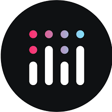

# Zomato Restaurants - Uma análise do modelo de negócio usando Python

## Problema de Negócio:
 A Zomato Restaurants é um serviço de busca de restaurantes para quem quer sair para jantar, buscar ou pedir sua comida favorita.
 Está presente em vários países como Índia, Brasil, Portugal, Turquia, Indonésia, Nova Zelândia, Itália, Filipinas, África do Sul, 
 Sri Lanka, Catar, Emirados Árabes Unidos, Reino Unido, Estados Unidos, Austrália e Canadá.

 A empresa possui um modelo de negócios de prover informações, menus e reviews de usuários para restaurantes além de serviço de delivery
 direto para restaurantes parceiros ao redor do mundo.

 ## Análise dos dados
 ### Premissas assumidas
 - A análise foi realizada usando dados do site Kaggle e são públicos.
 - As informações geradas e gráficos plotados foram separados em regionalidade (Cidade e Países) e ainda em
 tipos de comida ofertadas
 - A abrangência, a quantidade de restaurantes e as avaliações foram dados cruciais para a elaboração desse estudo.

 ### Divisão do Estudo
 #### 1. Visão Geral:

- Abrangência, distribuição e capilaridade dos restaurantes com a quantidade de tipos culinários disponíveis.
- Mapa global com localização de cada restaurantes que faz parte do banco de dados da empresa, com dados relevantes como tipo culinário e nota média dos consumidores.
 #### 2. Visão por País:
 - Informações úteis agrupadas por países presentes na plataforma, como quantidade de restaurantes, quantidade de cidades representadas, maiores notas por país, preço médio e melhores restaurantes do Brasil.
 
 #### 3. Visão por Cidade:
 - Cidades com mais resturantes, melhores e piores avaliações de  restaurantes por cidade e cidades com maior quantidade de tipos culinários diferentes.

 #### 4. Visão por tipo Culinário:
 - Melhores restaurantes para cada tipo culinário principal, os 10 mais bem avaliados restaurantes da plataforma, melhores e piores avaliações para cada tipo culinário e os mais bem avaliados de comida brasileira fora do Brasil.

## Insights de Dados
1. A Índia concentra a maior parte dos restaurantes cadastrados na plataforma. Mas a Indonésia possui mais avaliações para seus restaurantes.
2. A distribuição da Plataforma pelo Brasil ainda é restrita a São Paulo, Brasília e Rio de Janeiro.
3. Os restaurantes brasileiros não são muito bem avaliados.

## Produto Final do Projeto
Foi criado um painel online, hospedado em Cloud e disponível para acesso em qualquer dispositivo conectado à internet através do link: https://dashboardzomato-nicoletti.streamlit.app/

## Conclusão
O objetivo do projeto foi de elucidar e trazer informações através de gráficos e tabelas das métricas da plataforma para que a empresa tire estratégias e ações para expandir e melhorar seus negócios.

# Tecnologias e Ferramentas

	<code></code>
	<code></code>
	<code></code>
	<code></code>
	<code></code>
	<code></code>

